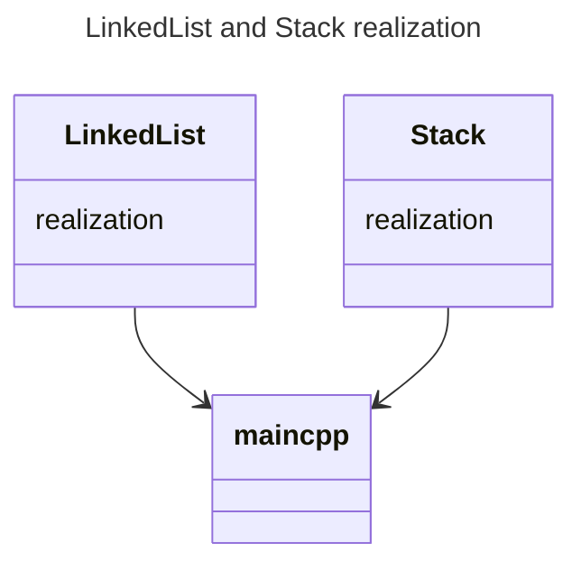

# Jautajumi

### LinkedList
1. **Linked List** — это абстрактная структура данных, представляющая собой последовательность элементов, где каждый элемент содержит ссылку на следующий элемент в списке. 

2. #### Примущества и Недостатки
    #### Примущества связанного списка:
    - Гибкость вставки и удаления: В отличие от массивов, где вставка или удаление элементов может потребовать перемещения большого количества элементов
    - Динамическое выделение памяти: Связанные списки позволяют выделять память под каждый элемент по мере необходимости, что обеспечивает гибкость в управлении памятью и избегает проблемы с ограничением размера.
    - Простота расширения: Связанные списки могут легко расширяться, поскольку добавление новых элементов не требует перемещения остальных элементов.
    
   #### Недостатки связанного списка:
    - Неэффективный доступ по индексу: Для доступа к элементу по индексу нужно последовательно пройти от начала списка до нужного элемента, что делает операцию доступа к элементу по индексу менее эффективной, чем в массиве.
    - Дополнительное использование памяти: Каждый элемент связанного списка требует дополнительной памяти для хранения ссылки на следующий элемент, что может привести к дополнительным расходам памяти.
    - В связанных списках нет прямой поддержки операций, таких как случайный доступ или прямое обращение к элементам, что делает их менее подходящими для некоторых видов алгоритмов и задач.

3. #### Примеры в которых они часто используются:
    - Реализация динамических структур данных: Связанные списки широко применяются для реализации таких структур данных, как стеки, очереди и списки. В этих структурах связанные списки позволяют эффективно добавлять и удалять элементы в любом месте.
    - Работа с большими данными: При работе с большими объемами данных, когда размеры данных могут изменяться динамически, связанные списки могут быть предпочтительнее массивов из-за их способности динамически расширяться.
    - Управление памятью: Связанные списки могут быть использованы в системах управления памятью, таких как управление памятью операционных систем или управление кучей в языках программирования, чтобы эффективно управлять доступной памятью.
    - Реализация файловых систем: В файловых системах, где файлы могут быть произвольного размера и распределены по диску, связанные списки могут использоваться для организации и хранения информации о файлах и их блоках данных.
---

### Stack
4. **Stack** - это абстрактная структура данных, которая следует принципу "последний вошел, первый вышел" (Last In, First Out, LIFO). Это означает, что последний элемент, добавленный в стек, будет первым, который будет удален из стека. 
Основные операции со стеком включают:
    - **Push**: Добавление элемента на вершину стека.
    - **Pop**: Удаление элемента с вершины стека.
    - **Peek/Top**: Получение значения элемента на вершине стека без его удаления.
    - **IsEmpty**: Проверка, пуст ли стек.
    - **IsFull**: Проверка, заполнен ли стек (в случае стека с фиксированным размером).

5. #### Примущества и Недостатки
    #### Примущества:
    - **Простота реализации**: Операции push и pop просты в реализации и понимании, что делает стек легким для использования и понимания.
    - **Эффективность операций**: Вставка и удаление элементов происходят за постоянное время O(1), что делает стек эффективной структурой данных для операций добавления и удаления в начале списка.
    - Логическая структура: Стек естественно соответствует многим задачам, в которых элементы обрабатываются в порядке "последний вошел, первый вышел" (LIFO), таким как управление вызовами функций или обработка операций отмены.

   #### Недостатки:
    - Ограниченный доступ: Стек предоставляет доступ только к верхнему элементу, что ограничивает его применимость в некоторых сценариях, где требуется произвольный доступ к элементам.
    - Ограниченный размер: В зависимости от реализации стека, его размер может быть ограничен, что может привести к проблемам с переполнением (stack overflow), если количество элементов превышает предельное значение.
    - Неэффективность при поиске: В стеке отсутствует прямой доступ к элементам, и операции поиска или доступа к элементам, находящимся не на вершине, требуют выполнения операций pop и push для просмотра содержимого.

6. #### Примеры применений stack:
    - Управление вызовами функций: Во время выполнения программы вызовы функций могут быть управляемы с использованием стека. Каждый раз, когда функция вызывается, информация о ней (например, локальные переменные и адрес возврата) помещается в стек. После завершения выполнения функции эта информация удаляется из стека, и управление передается обратно вызывающей функции.

    - Вычисление арифметических выражений: Стеки могут быть использованы для реализации алгоритмов вычисления арифметических выражений, таких как обратная польская запись. В этом случае операнды помещаются в стек, а затем выполняются операции в порядке, определенном стеком.

    - Управление историей операций (undo/redo): Стеки могут использоваться для реализации функционала отмены и повтора действий в приложениях. Каждое действие помещается в стек, и при необходимости можно откатить или повторить действие, извлекая его из стека.

    - Обратный обход деревьев и графов: При обходе деревьев и графов в глубину стек может использоваться для хранения путей и вершин, которые еще не были посещены, чтобы обеспечить правильный порядок обхода.

    - Реализация рекурсивных алгоритмов: Рекурсивные алгоритмы могут быть эффективно реализованы с использованием стека. Например, стек может использоваться для хранения промежуточных результатов и вызовов функций при реализации алгоритма поиска в глубину.
---
### Queue
7. **Queue** - это абстрактная структура данных, которая работает по принципу "первым пришел, первым ушел" (First In, First Out, FIFO). Это означает, что элементы добавляются в конец очереди, а удаляются из начала.
    #### Основные операции с очередью включают:

    - Enqueue (или Push): Добавление элемента в конец очереди.
    - Dequeue (или Pop): Удаление элемента из начала очереди.
    - Peek (или Front): Получение значения элемента в начале очереди без его удаления.
    - IsEmpty: Проверка, пуста ли очередь.
    - IsFull: Проверка, заполнена ли очередь (в случае очереди с фиксированным размером).

8.  #### Примущества и Недостатки

    #### Примущества:
    - Порядок обработки: Очередь следует принципу FIFO (First In, First Out), что гарантирует сохранение порядка, в котором элементы были добавлены, что может быть критически важным для некоторых приложений.
    - Простота использования: Операции добавления и удаления элементов из очереди (enqueue и dequeue) просты в реализации и использовании.
    - Управление потоками данных: Очереди широко используются для управления потоками данных, особенно в многопоточных приложениях, где требуется безопасный и последовательный доступ к данным.
    - Буферизация и сглаживание нагрузки: Очереди могут использоваться для буферизации данных и сглаживания нагрузки, позволяя временно сохранять данные, когда производство и потребление данных не совпадают.

   #### Недостатки:
    - Ограниченность размера: В зависимости от реализации, очередь может иметь ограниченный размер, что может привести к проблемам с переполнением (queue overflow), если количество элементов превышает предельное значение.
    - Неэффективность при поиске: В отличие от других структур данных, таких как списки или деревья, очередь не обеспечивает прямой доступ к элементам, находящимся в середине, что делает неэффективными операции поиска или обращения к элементам внутри очереди.
    - Ограниченные операции: Операции с очередью обычно ограничены добавлением элементов в конец и удалением из начала. Например, доступ к элементам по индексу не поддерживается.
    - Ожидание блокировки: В многопоточных сценариях операции enqueue и dequeue могут быть блокирующими, что может привести к ожиданию, если другой поток заблокирован на доступ к очереди.
    
9. #### Примеры применений Queues

    - Обработка запросов в веб-серверах: Веб-серверы могут использовать очереди для управления запросами от клиентов. Каждый новый запрос помещается в очередь, а веб-сервер обрабатывает их в порядке поступления.

    - Системы управления заказами: В системах управления заказами, таких как системы электронной коммерции или кассовые системы в розничной торговле, очереди используются для управления заказами и обработки их в очередности.

    - Очереди сообщений: Очереди сообщений широко используются для обмена данными между различными компонентами системы, микросервисами или приложениями. Они обеспечивают гарантированную доставку сообщений и позволяют управлять потоком данных.

    - Обработка задач в фоновых процессах: В системах, где требуется обработка фоновых задач, таких как обновление баз данных, отправка электронной почты или генерация отчетов, очереди могут использоваться для планирования и выполнения этих задач.

    - Управление памятью и буферизация ввода-вывода: Очереди могут использоваться для буферизации данных ввода-вывода, таких как данные, поступающие из сети или записываемые на диск, что позволяет сглаживать пиковые нагрузки и улучшать производительность.
--- 
 

### Useful terminal commands:
- make
- make clean
- make push
