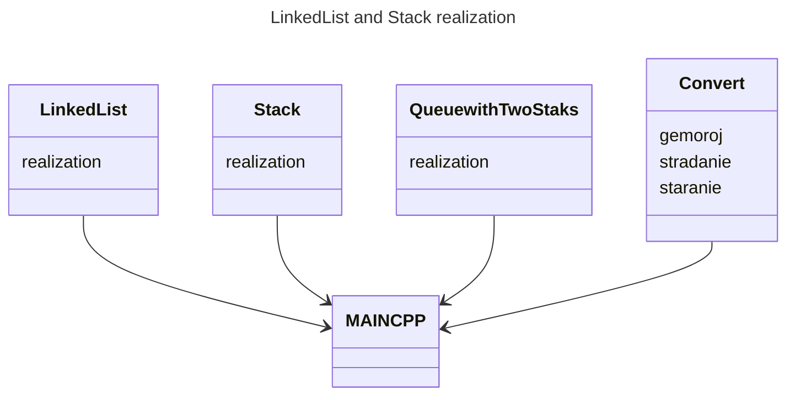

# Jautajumi

### LinkedList
1. **Linked List** — это абстрактная структура данных, представляющая собой последовательность элементов, где каждый элемент содержит ссылку на следующий элемент в списке. 

2. #### Примущества и Недостатки
    #### Примущества связанного списка:
    - С ними удобно добавлять и удалять элементы, потому что не нужно двигать все остальные в списке, как в массивах.
    - Память выделяется под каждый элемент по мере необходимости, так что можно гибко управлять памятью.
    - Их легко расширять, новые элементы можно просто добавлять.
    
   #### Недостатки связанного списка:
    - Доступ к элементам по индексу не очень эффективен, потому что приходится последовательно просматривать все элементы до нужного.
    - Они требуют больше памяти из-за ссылок на следующие элементы.
    - Нельзя сразу обратиться к элементу, как в массиве, нужно последовательно пройти от начала списка.

3. #### Примеры в которых они часто используются:
    - В структурах данных типа стека, очереди или списков, где нужно добавлять и удалять элементы.
    - При работе с большими данными, когда размеры данных меняются.
    - В управлении памятью операционных систем или в программировании для управления памятью.
    - В файловых системах для хранения информации о файлах и данных.
---

### Stack
4. **Stack** - это абстрактная структура данных, которая следует принципу "последний вошел, первый вышел" (Last In, First Out, LIFO). Это означает, что последний элемент, добавленный в стек, будет первым, который будет удален из стека. 
Основные операции со стеком включают:
    - **Push**: Добавление элемента на вершину стека.
    - **Pop**: Удаление элемента с вершины стека.
    - **Peek/Top**: Получение значения элемента на вершине стека без его удаления.
    - **IsEmpty**: Проверка, пуст ли стек.
    - **IsFull**: Проверка, заполнен ли стек (в случае стека с фиксированным размером).

5. #### Примущества и Недостатки
    #### Примущества:
    - операции добавления и удаления элементов легко понять и реализовать.
    - добавление и удаление элементов происходят быстро (за постоянное время), что делает стек эффективным.
    - стек подходит для многих задач, где нужно управлять элементами в порядке LIFO, как в управлении вызовами функций или отменой операций.

   #### Недостатки:
    - у стека есть свои ограничения, например, доступ только к верхнему элементу.
    - Ограниченный размер: если размер стека ограничен, то может возникнуть проблема переполнения.
    - Неудобство при поиске: если нам нужно обратиться к элементу, который не на верхушке, это может быть неудобно, так как доступ ограничен.
6. #### Примеры применений stack:
    - Управление вызовами функций.
    - Решение арифметических выражений.
    - Отмена и повтор действий в приложениях.
    - Обход графов.
    - Реализация рекурсивных алгоритмов.
---
### Queue
7. **Queue** - это абстрактная структура данных, которая работает по принципу "первым пришел, первым ушел" (First In, First Out, FIFO). Это означает, что элементы добавляются в конец очереди, а удаляются из начала.
    #### Основные операции с очередью включают:

    - Enqueue (или Push): Добавление элемента в конец очереди.
    - Dequeue (или Pop): Удаление элемента из начала очереди.
    - Peek (или Front): Получение значения элемента в начале очереди без его удаления.
    - IsEmpty: Проверка, пуста ли очередь.
    - IsFull: Проверка, заполнена ли очередь (в случае очереди с фиксированным размером).

8.  #### Примущества и Недостатки

    #### Примущества:
    - Сохранение порядка, очередь сохраняет порядок, в котором элементы были добавлены, что важно в некоторых случаях.
    - Простота использования, операции добавления и удаления элементов просты и понятны.
    - Управление данными, очереди хорошо подходят для управления данными в многопоточных приложениях и буферизации данных.

   #### Недостатки:
    - если у очереди ограниченный размер, может возникнуть проблема переполнения.
    - доступ к элементам в середине очереди не так удобен, как в других структурах данных.
    - мы можем только добавлять в конец и удалять из начала, что ограничивает применение в некоторых ситуациях.

9. #### Примеры применений Queues

    - В веб-серверах для обработки запросов.
    - В системах управления заказами в интернет-магазинах.
    - Для обмена сообщениями между компонентами системы.
    - В обработке фоновых задач, например, обновления баз данных.
--- 
 

### Useful terminal commands:
- make
- make clean
- make push
