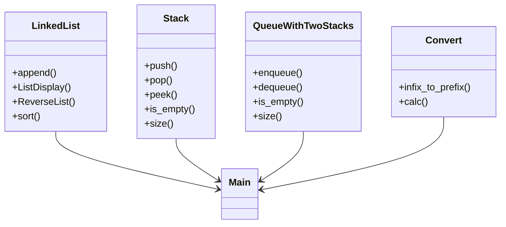

# 🔧 Advanced data structures & algorithms

A C++ project implementing fundamental data structures and algorithms:

- 🧩 Linked List  
- 📚 Stack  
- ⛓️ Queue (via two stacks)  
- 🧮 Infix to Prefix conversion and evaluation  

Includes hands-on demonstrations and terminal commands for compiling and testing.

---

## 🏗️ Features

- **Linked List** with append, display, reverse, and custom sort
- **Stack** with push, pop, peek, and size
- **Queue** implemented using two stacks
- **Expression Converter**: from infix to prefix with evaluation
- **Bonus**: memory cleanup and manual stack deletion

---

## 🖥️ How to Run

### 🛠 Compile
```bash
make
```
🧹 Clean build files
```
make clean
```

📁 Project Structure

├── main.cpp         # All implementations and test cases<br>
├── Makefile         # Build automation<br>
├── README.md        # Project overview<br>
├── answers.md       # Theoretical explanations <br>

### 📊 Visual Overview (Mermaid)


